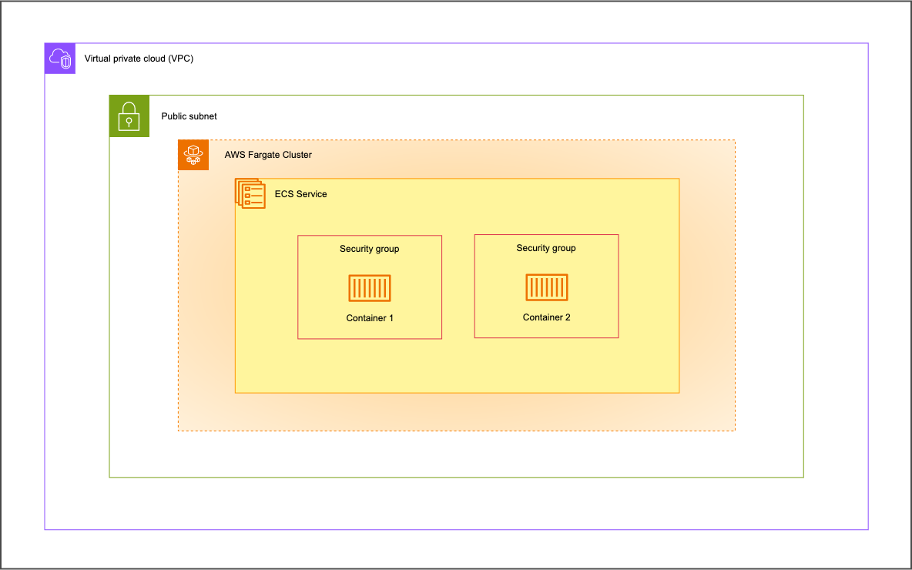

# Deploy Docker Containers With AWS Fargate
Hey everyone 👋
In this project, I have deployed an Docker container in an ECS Task using AWS Fargate. ☁️

As you can see, the infrastructure consists of:
- One VPC
- One Subnet
- One Internet Gateway
- One Route Table
- One Security Group
- One ECS Fargate Cluster 
- One ECS Service
- One NGINX Container *(There is two containers in the schema but there is actually one in the code)*
---
> [!NOTE]
> You can deploy the same infrastructure by changing the variable values in the `project.tfvars` file. You can also change the current container properties or add more containers by editing the `container-definition.json` file. To learn how to change this file, check out the [AWS Docs for Task Definition Parameters](https://docs.aws.amazon.com/AmazonECS/latest/developerguide/task_definition_parameters.html)